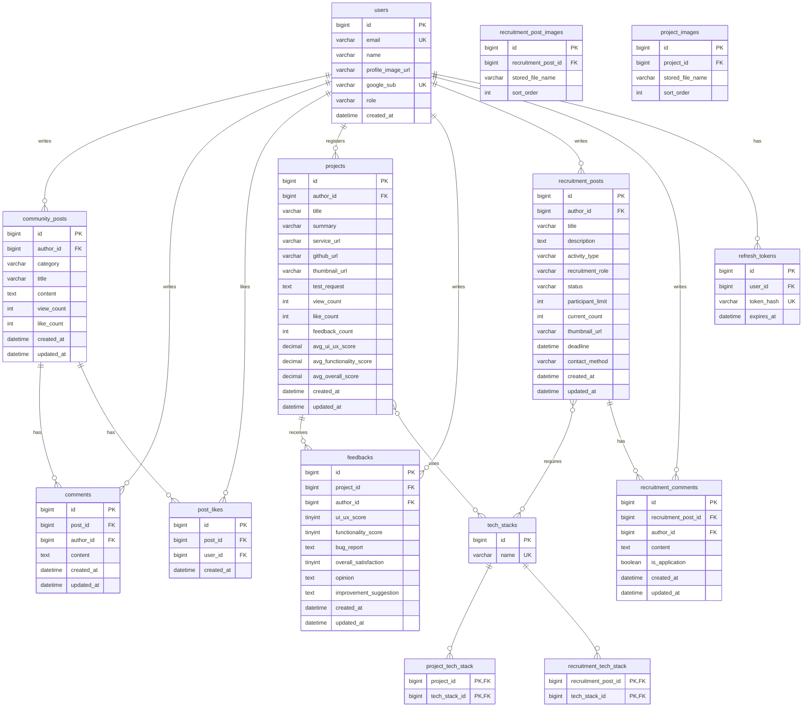

# HIS-Link ERD

> 요구사항(AR1~AR5) 기준 논리·물리 모델 초안.  
> JPA `ddl-auto: update` 전제, FK 방향·인덱스는 구현 시 반영.

## 1. ER 다이어그램 (개요)

---

## 2. 테이블 정의

### 2.1 users (구현 완료)

| 컬럼 | 타입 | 제약 | 설명 |
|------|------|------|------|
| id | BIGINT | PK, AI | 사용자 ID |
| email | VARCHAR(255) | NOT NULL, UK | 한동 이메일 |
| name | VARCHAR(100) | NOT NULL | 표시 이름 |
| profile_image_url | VARCHAR(500) | | Google 프로필 |
| google_sub | VARCHAR(255) | NOT NULL, UK | Google sub |
| role | VARCHAR(20) | NOT NULL | USER, ADMIN |
| created_at | DATETIME | NOT NULL | 가입 시각 |

### 2.2 refresh_token (구현 완료)

| 컬럼 | 타입 | 제약 | 설명 |
|------|------|------|------|
| id | BIGINT | PK, AI | |
| user_id | BIGINT | FK → users.id | |
| token_hash | VARCHAR(64) | NOT NULL, UK | refresh JWT SHA-256 |
| expires_at | DATETIME | NOT NULL | 만료 |

### 2.3 community_post (AR3) ✅

| 컬럼 | 타입 | 제약 | 설명 |
|------|------|------|------|
| id | BIGINT | PK, AI | |
| author_id | BIGINT | FK → users.id | 작성자 |
| category | VARCHAR(30) | NOT NULL | FREE, QNA, INFO, TROUBLESHOOTING |
| title | VARCHAR(200) | NOT NULL | |
| content | TEXT | NOT NULL | |
| view_count | INT | NOT NULL, DEFAULT 0 | 조회수 |
| like_count | INT | NOT NULL, DEFAULT 0 | 비정규화(좋아요 수) |
| created_at | DATETIME | NOT NULL | |
| updated_at | DATETIME | NOT NULL | |

**인덱스:** `(category, created_at DESC)`, `(author_id)`

### 2.4 comment (AR3)

| 컬럼 | 타입 | 제약 | 설명 |
|------|------|------|------|
| id | BIGINT | PK, AI | |
| post_id | BIGINT | FK → community_post.id | |
| author_id | BIGINT | FK → users.id | |
| content | TEXT | NOT NULL | |
| created_at | DATETIME | NOT NULL | |
| updated_at | DATETIME | NOT NULL | |

**인덱스:** `(post_id, created_at)`

### 2.5 post_like (AR3)

| 컬럼 | 타입 | 제약 | 설명 |
|------|------|------|------|
| id | BIGINT | PK, AI | |
| post_id | BIGINT | FK → community_post.id | |
| user_id | BIGINT | FK → users.id | |
| created_at | DATETIME | NOT NULL | |

**UK:** `(post_id, user_id)` — 중복 좋아요 방지

### 2.6 project (AR4)

| 컬럼 | 타입 | 제약 | 설명 |
|------|------|------|------|
| id | BIGINT | PK, AI | |
| author_id | BIGINT | FK → users.id | |
| title | VARCHAR(200) | NOT NULL | |
| summary | VARCHAR(500) | NOT NULL | 한 줄 소개 |
| service_url | VARCHAR(500) | | 배포 URL |
| github_url | VARCHAR(500) | | |
| thumbnail_url | VARCHAR(500) | | 대표 이미지 |
| test_request | TEXT | | 테스트 요청 사항 |
| view_count | INT | DEFAULT 0 | |
| like_count | INT | DEFAULT 0 | 인기 정렬용 |
| feedback_count | INT | DEFAULT 0 | 피드백 수 정렬용 |
| avg_ui_ux_score | DECIMAL(3,2) | | 피드백 평균 |
| avg_functionality_score | DECIMAL(3,2) | | |
| avg_overall_score | DECIMAL(3,2) | | |
| created_at | DATETIME | NOT NULL | |
| updated_at | DATETIME | NOT NULL | |

### 2.7 feedback (AR4)

| 컬럼 | 타입 | 제약 | 설명 |
|------|------|------|------|
| id | BIGINT | PK, AI | |
| project_id | BIGINT | FK → project.id | |
| author_id | BIGINT | FK → users.id | |
| ui_ux_score | TINYINT | NOT NULL | 1~5 |
| functionality_score | TINYINT | NOT NULL | 1~5 |
| bug_report | TEXT | | |
| overall_satisfaction | TINYINT | NOT NULL | 1~5 |
| opinion | TEXT | | |
| improvement_suggestion | TEXT | | |
| created_at | DATETIME | NOT NULL | |
| updated_at | DATETIME | NOT NULL | |

**UK (권장):** `(project_id, author_id)` — 사용자당 프로젝트 1회 피드백 (정책에 따라 변경 가능)

### 2.8 tech_stack (공통)

| 컬럼 | 타입 | 제약 | 설명 |
|------|------|------|------|
| id | BIGINT | PK, AI | |
| name | VARCHAR(50) | NOT NULL, UK | React, Spring Boot 등 |

### 2.9 project_tech_stack (M:N)

| 컬럼 | 타입 | 제약 |
|------|------|------|
| project_id | BIGINT | PK, FK |
| tech_stack_id | BIGINT | PK, FK |

### 2.9a project_image (AR4)

| 컬럼 | 타입 | 제약 | 설명 |
|------|------|------|------|
| id | BIGINT | PK, AI | |
| project_id | BIGINT | FK → project.id | |
| stored_file_name | VARCHAR(255) | NOT NULL | 업로드 파일명 |
| sort_order | INT | NOT NULL | 표시 순서 |

### 2.10 recruitment_post (AR5) ✅

| 컬럼 | 타입 | 제약 | 설명 |
|------|------|------|------|
| id | BIGINT | PK, AI | |
| author_id | BIGINT | FK → users.id | |
| title | VARCHAR(200) | NOT NULL | |
| description | TEXT | NOT NULL | |
| activity_type | VARCHAR(30) | NOT NULL | PROJECT, HACKATHON, CONTEST, COMPETITION |
| recruitment_role | VARCHAR(30) | NOT NULL | FRONTEND, BACKEND, AI_DATA, DESIGN, PM, OTHER |
| status | VARCHAR(20) | NOT NULL | OPEN, CLOSED |
| participant_limit | INT | NOT NULL | |
| current_count | INT | DEFAULT 0 | 지원 인원 |
| thumbnail_url | VARCHAR(500) | | 첫 이미지 URL |
| deadline | DATETIME | | |
| contact_method | VARCHAR(200) | | |
| created_at | DATETIME | NOT NULL | |
| updated_at | DATETIME | NOT NULL | |

**인덱스:** `(status, recruitment_role, created_at DESC)` — activity_type 필터는 애플리케이션 쿼리

### 2.10a recruitment_post_image (AR5)

| 컬럼 | 타입 | 제약 | 설명 |
|------|------|------|------|
| id | BIGINT | PK, AI | |
| recruitment_post_id | BIGINT | FK → recruitment_post.id | |
| stored_file_name | VARCHAR(255) | NOT NULL | |
| sort_order | INT | NOT NULL | |

### 2.11 recruitment_tech_stack (M:N)

| 컬럼 | 타입 | 제약 |
|------|------|------|
| recruitment_post_id | BIGINT | PK, FK |
| tech_stack_id | BIGINT | PK, FK |

### 2.12 recruitment_comment (AR5)

| 컬럼 | 타입 | 제약 | 설명 |
|------|------|------|------|
| id | BIGINT | PK, AI | |
| recruitment_post_id | BIGINT | FK | |
| author_id | BIGINT | FK → users.id | |
| content | TEXT | NOT NULL | |
| is_application | BOOLEAN | DEFAULT false | 지원 의사 |
| created_at | DATETIME | NOT NULL | |
| updated_at | DATETIME | NOT NULL | |

---

## 3. Enum 정리

| Enum | 값 | 사용 테이블 |
|------|-----|-------------|
| Role | USER, ADMIN | users |
| PostCategory | FREE, QNA, INFO, TROUBLESHOOTING | community_post |
| RecruitmentActivityType | PROJECT, HACKATHON, CONTEST, COMPETITION | recruitment_post |
| RecruitmentRole | FRONTEND, BACKEND, AI_DATA, DESIGN, PM, OTHER | recruitment_post |
| RecruitmentStatus | OPEN, CLOSED | recruitment_post |
| ProjectSort | LATEST, POPULAR, FEEDBACK | project 목록 쿼리 |

---

## 4. FK·삭제 정책

| 관계 | ON DELETE |
|------|-----------|
| community_post → users | RESTRICT (작성자 탈퇴 시 별도 정책) |
| comment → community_post | CASCADE |
| post_like → community_post | CASCADE |
| feedback → project | CASCADE |
| project_tech_stack | CASCADE |

---

## 5. 구현 우선순위 (완료 기준)

1. ✅ community_post, comment, post_like (AR3)
2. ✅ project, project_image, feedback, tech_stack (AR4)
3. ✅ recruitment_post, recruitment_post_image, recruitment_comment (AR5)
4. ✅ main 집계 API (AR2)
